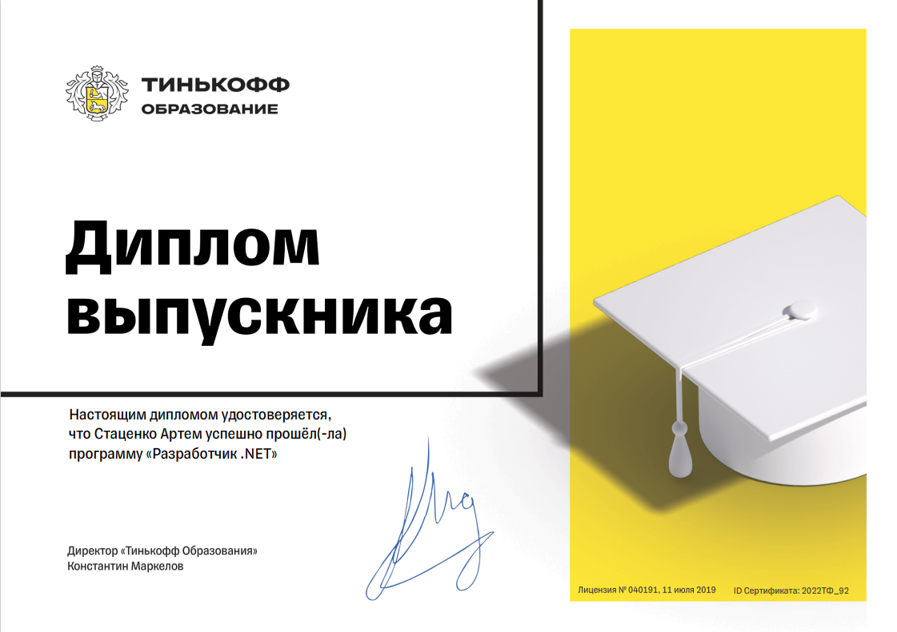

# Разработчик .NET от Т-Банка, 2022. Проект: Разработка минибанковского приложения

## Описание

Проект состоит из реализации приложения для банка, в котором можно будет производить конвертацию валюты, добавлять новых клиентов, открывать им счета, осуществлять перевод денежных средств между клиентами.

## Функциональные требования

- реализовать получение курсов валют через внешний api - сайта ЦБ РФ: https://www.cbr-xml-daily.ru
- реализовать возможность добавления, обновления и удаления клиентов банка
- перед добавлением нового клиента и обновлением данных существующего убедиться, что указанный логин и электронный адрес свободен
- при удалении клиента проверять, есть ли у него открытые банковские счета: если они есть - не удалять клиента
- реализовать возможность для открытия и закрытия банковского счета, обновления его данных, у одного клиента может быть несколько банковских счетов
- разработать механизм перевода денежных средств между клиентами, хранить историю транзакций
- сделать механизм валидации данных клиента и банковского счета при их создании и обновлении